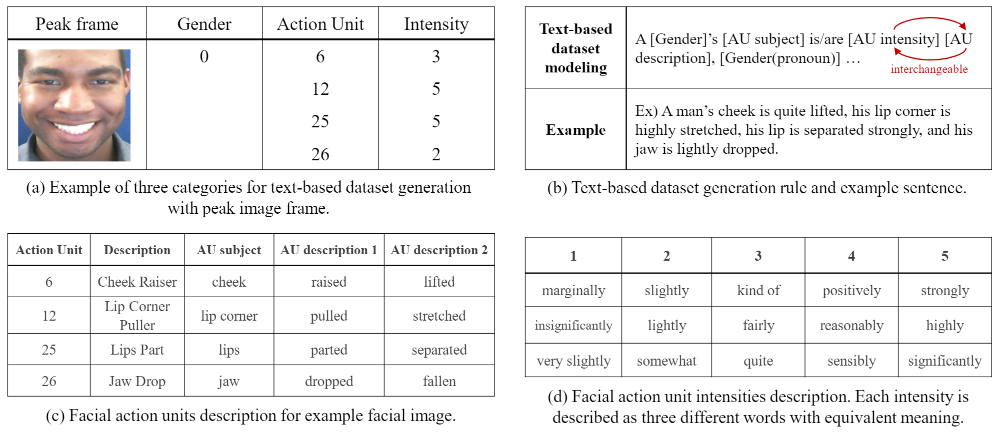

# Text-based-dataset-with-comprehensive-facial-expression-sentence
This repository provides Text-based dataset with comprehensive facial expression sentence using CK+, DISFA+, and MMI datasets used in paper [Face Tells Detailed Expression: Generating Comprehensive Facial Expression Sentence through Facial Action Units](https://link.springer.com/chapter/10.1007/978-3-030-37734-2_9)

Recent Updates
----------
- The implementation of this paper is now [under construction](https://github.com/joannahong/Face-Tells-Detailed-Expression).

## Text-based dataset generation model


## Facial image dataset download
You firstly need to download facial image datasets from the original database download pages:
- [CK+ database](http://www.consortium.ri.cmu.edu/ckagree/)
- [DISFA+ database](http://mohammadmahoor.com/disfa/)
- [MMI database](https://mmifacedb.eu/)

## Text-based dataset download
Text-based dataset with comprehensive facial expression sentence with instruction for using these dataset along with downloaded facial image datasets is included below:
- [CK+](https://drive.google.com/open?id=1B0eTek1AP5lBm7x1XdLd2jNbTF_3e_7d)
- [DISFA+](https://drive.google.com/open?id=1zHSfGIKxEJWH_swVWTzAj2mdkZo1PnZX)
- [MMI](https://drive.google.com/open?id=122FqZbHLjoNsefmX6aAXEzkPRDsxSQXt)


## Reference
- [Extended Cohn–Kande Dataset (CK+): a complete facial expression dataset for action unit and emotion-specified expression](http://www.iainm.com/publications/Lucey2010-The-Extended/paper.pdf)
- [Extended DISFA Dataset: Investigating Posed and Spontaneous Facial Expressions](http://openaccess.thecvf.com/content_cvpr_2016_workshops/w28/papers/Mavadati_Extended_DISFA_Dataset_CVPR_2016_paper.pdf) 
- [Web-based database for facial expression analysis](https://ieeexplore.ieee.org/document/1521424)

## Citation
Please cite the following paper if you have use this code:
```
@inproceedings{hong2020face,
  title={Face Tells Detailed Expression: Generating Comprehensive Facial Expression Sentence Through Facial Action Units},
  author={Hong, Joanna and Lee, Hong Joo and Kim, Yelin and Ro, Yong Man},
  booktitle={International Conference on Multimedia Modeling},
  pages={100--111},
  year={2020},
  organization={Springer}
}
```
